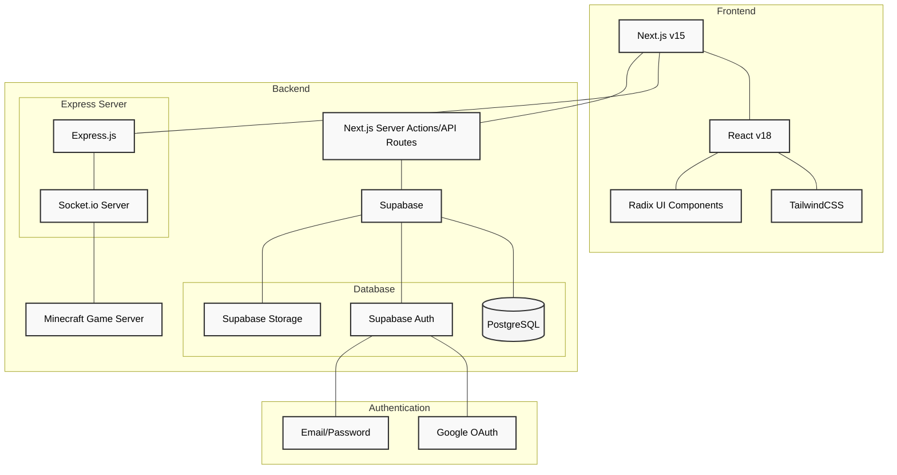

# BlockWarriors Command Block

Welcome to the BlockWarriors Command Block! This is a monolithic repository for managing BlockWarriors tournaments and teams.

## Applications

### BlockWarriors Command Block - Next.js Application

A modern web dashboard for BlockWarriors tournament and team management.

**Tech Stack:**

- Next.js, TypeScript, Tailwind CSS
- Radix UI components
- Supabase for backend services
- Real-time updates via Socket.io client

**Setup Instructions:**
Go to [blockwarriors-next](https://github.com/project-blockwarriors/blockwarriors-cmd/tree/main/blockwarriors-next) for detailed instructions.

### BlockWarriors Command Block - Socket.io Server

Real-time communication server handling live updates and events.

**Tech Stack:**

- Node.js with Express
- Socket.io for WebSocket communication
- Environment configuration with dotenv

## Information about the Project

- **Project Name**: BlockWarriors Command Block
- **Description**: A web application for managing BlockWarriors tournaments and teams.
- **Repository**: [https://github.com/project-blockwarriors/blockwarriors-cmd](https://github.com/project-blockwarriors/blockwarriors-cmd)

## Technology Stack



## How to Contribute

To maintain a clean and functional main branch while allowing contributors to work independently, this repository follows a strict branching and merging procedure.

## Contribution Workflow

1. **Work in a Feature Branch**

   - Every contributor works out of their own branch.
   - Follow the branch naming convention: `{first name initial}{lastname}-{feature}`
     - Examples:
       - `jdoe-login-page`
       - `asmith-bugfix123`
       - `mjones-update-readme`

2. **Update Your Branch Regularly**

   - Keep your branch up to date with the main branch by regularly pulling the latest changes.
     ```bash
     git pull origin main
     ```

3. **Commit Frequently and Meaningfully**

   - Write clear and descriptive commit messages.
     - Good: `Fix null pointer exception in login handler`
     - Bad: `Fixed stuff`

4. **Run Tests**

   - Ensure that your changes do not break the build by running all relevant tests locally.

5. **Create a Pull Request (PR)**

   - Once your feature or fix is complete, create a pull request to merge your branch into the main branch.
   - Include a clear title and description for the PR:
     - Title: `Add login page functionality`
     - Description: "This PR includes the implementation of the login page, user authentication logic, and relevant unit tests."
   - Assign a reviewer to your PR.

6. **Code Review**

   - Reviewers will provide feedback and request changes if necessary.
   - Address all comments and suggestions before requesting another review.

7. **Merge to Main**

   - Once the PR is approved, squash and merge your branch into main.
     - Ensure there are no merge conflicts.
     ```bash
     git checkout main
     git pull origin main
     git merge --squash your-branch
     git push origin main
     ```
   - Delete your branch after merging.
