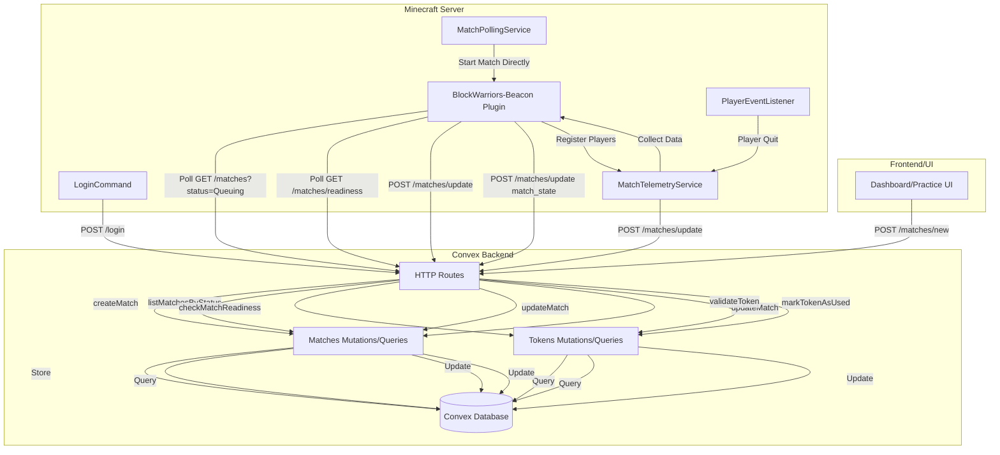
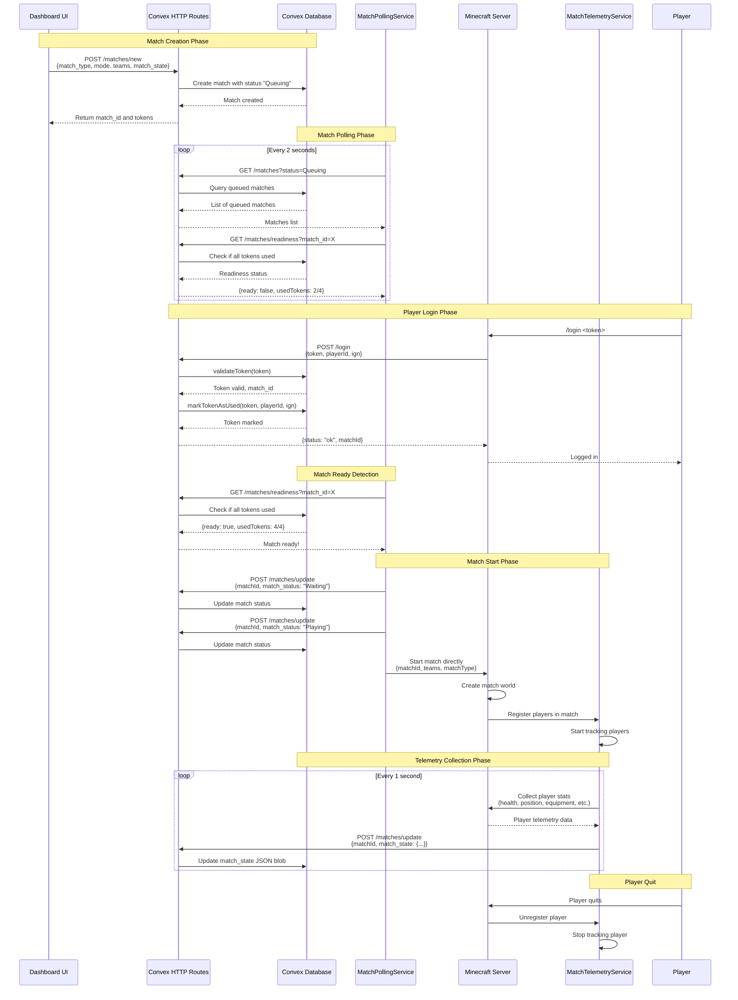

# Match System Architecture

This document describes how the match system components interact with each other.

## System Overview



## Match Lifecycle Flow



## Component Details

### MatchPollingService

- **Purpose**: Polls Convex for queued matches and starts them when ready
- **Frequency**: Every 2 seconds
- **Key Operations**:
  - Fetch queued matches
  - Check match readiness (all tokens used)
  - Update match status (Waiting → Playing)
  - Start match directly when ready

### MatchTelemetryService

- **Purpose**: Collects and stores player telemetry data during matches
- **Frequency**: Every 1 second
- **Key Operations**:
  - Track players in active matches
  - Collect player stats (health, position, equipment, kills/deaths)
  - Update match_state via HTTP routes
  - Unregister players when they quit

### LoginCommand

- **Purpose**: Handles player login via HTTP routes
- **Key Operations**:
  - Sends login request to Convex HTTP route
  - Validates token and marks it as used
  - Tracks logged-in players locally

### Convex HTTP Routes

- **POST /matches/new**: Create new match with "Queuing" status
- **GET /matches**: List matches (optionally filtered by status)
- **GET /matches?id={id}**: Get single match by ID
- **GET /matches/readiness?match_id={id}**: Check if match is ready (all tokens used)
- **GET /matches/tokens?match_id={id}**: Get all tokens for a match
- **POST /matches/update**: Update match status and/or match_state
- **POST /login**: Validate token and mark as used

### Convex Mutations/Queries

- **matches.createMatch**: Create a new match
- **matches.updateMatch**: Update match status and/or state
- **matches.getMatchById**: Get match by ID
- **matches.listMatchesByStatus**: List matches by status
- **tokens.validateToken**: Validate a token
- **tokens.markTokenAsUsed**: Mark token as used with player info
- **tokens.checkMatchReadiness**: Check if all tokens for a match are used
- **tokens.getTokensByMatchId**: Get all tokens for a match

## Data Flow

### Match State Structure

```json
{
  "timestamp": 1234567890,
  "matchId": "j123...",
  "players": [
    {
      "playerId": "uuid",
      "ign": "PlayerName",
      "health": 20.0,
      "maxHealth": 20.0,
      "foodLevel": 20,
      "position": {
        "x": 0.0,
        "y": 64.0,
        "z": 0.0,
        "world": "world1"
      },
      "equipment": {
        "mainHand": "Diamond Sword",
        "helmet": "Diamond Helmet",
        "chestplate": "Diamond Chestplate",
        "leggings": "Diamond Leggings",
        "boots": "Diamond Boots"
      },
      "kills": 5,
      "deaths": 2,
      "nearbyPlayers": 3
    }
  ]
}
```

### Match Status Transitions

```
Queuing → Waiting → Playing → Finished/Terminated
```

- **Queuing**: Match created, waiting for all players to log in
- **Waiting**: All players logged in, match starting
- **Playing**: Match in progress, telemetry being collected
- **Finished**: Match completed normally
- **Terminated**: Match ended abnormally

## Key Interactions

1. **Match Creation**: UI creates match → Convex stores it with "Queuing" status
2. **Player Login**: Player logs in → HTTP route validates token → Token marked as used in Convex
3. **Match Detection**: Polling service checks readiness → When all tokens used, match starts directly
4. **Telemetry Collection**: Service collects player stats → Updates match_state in Convex
5. **Match State Rendering**: Website can query match_state → Render player telemetry data
