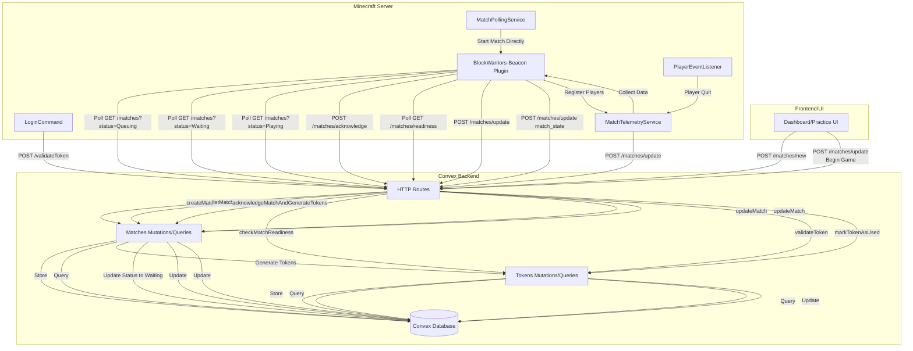
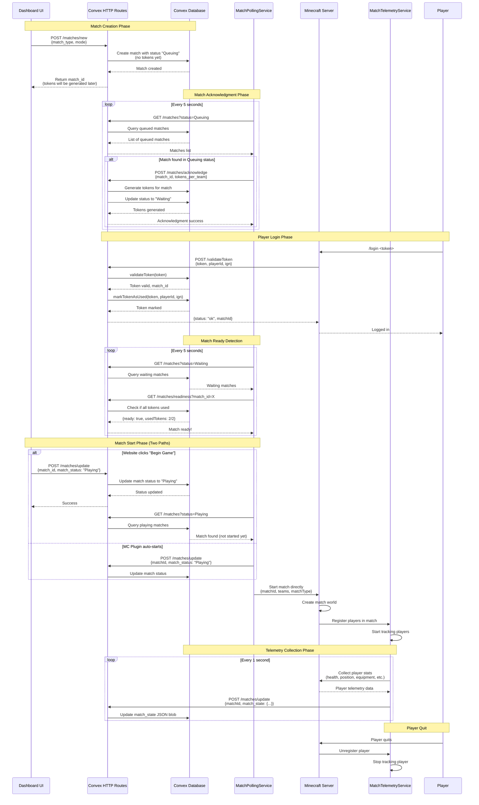

# Match System Architecture

This document describes how the match system components interact with each other.

## System Overview



## Match Lifecycle Flow



## Component Details

### MatchPollingService

- **Purpose**: Polls Convex for matches and manages the match lifecycle
- **Frequency**: Every 5 seconds
- **Key Operations**:
  - Fetch "Queuing" matches → Acknowledge them (generate tokens, set status to "Waiting")
  - Fetch "Waiting" matches → Check readiness (all tokens used)
  - Fetch "Playing" matches → Start match if not already started (handles website-initiated starts)
  - Update match status (Waiting → Playing)
  - Start match directly when ready

### MatchTelemetryService

- **Purpose**: Collects and stores player telemetry data during matches
- **Frequency**: Every 1 second
- **Key Operations**:
  - Track players in active matches
  - Collect player stats (health, position, equipment, kills/deaths)
  - Update match_state via HTTP routes
  - Unregister players when they quit

### LoginCommand

- **Purpose**: Handles player login via HTTP routes
- **Key Operations**:
  - Sends login request to Convex HTTP route
  - Validates token and marks it as used
  - Tracks logged-in players locally

### Convex HTTP Routes

- **POST /matches/new**: Create new match with "Queuing" status (no tokens generated yet)
- **POST /matches/acknowledge**: Acknowledge a queued match - atomically generates tokens and updates status to "Waiting"
- **GET /matches**: List matches (optionally filtered by status: `?status=Queuing|Waiting|Playing`)
- **GET /matches?id={id}**: Get single match by ID
- **GET /matches/readiness?match_id={id}**: Check if match is ready (all tokens used)
- **GET /matches/tokens?match_id={id}**: Get all tokens for a match
- **POST /matches/update**: Update match status and/or match_state
- **POST /validateToken**: Validate token and mark as used (replaces `/login`)

### Convex Mutations/Queries

- **matches.createMatch**: Create a new match (without tokens)
- **matches.acknowledgeMatchAndGenerateTokens**: Atomically acknowledge match, generate tokens, and update status to "Waiting"
- **matches.updateMatch**: Update match status and/or state
- **matches.getMatchById**: Get match by ID
- **matches.getMatchWithTokens**: Get match with tokens and player IGNs (for UI)
- **matches.listMatchesByStatus**: List matches by status
- **matches.archiveOldQueuedMatches**: Archive matches stuck in "Queuing" for >10 minutes
- **tokens.validateToken**: Validate a token
- **tokens.markTokenAsUsed**: Mark token as used with player info (includes IGN)
- **tokens.checkMatchReadiness**: Check if all tokens for a match are used
- **tokens.getTokensByMatchId**: Get all tokens for a match

## Data Flow

### Match State Structure

```json
{
  "timestamp": 1234567890,
  "matchId": "j123...",
  "players": [
    {
      "playerId": "uuid",
      "ign": "PlayerName",
      "health": 20.0,
      "maxHealth": 20.0,
      "foodLevel": 20,
      "position": {
        "x": 0.0,
        "y": 64.0,
        "z": 0.0,
        "world": "world1"
      },
      "equipment": {
        "mainHand": "Diamond Sword",
        "helmet": "Diamond Helmet",
        "chestplate": "Diamond Chestplate",
        "leggings": "Diamond Leggings",
        "boots": "Diamond Boots"
      },
      "kills": 5,
      "deaths": 2,
      "nearbyPlayers": 3
    }
  ]
}
```

### Match Status Transitions

```
Queuing → Waiting → Playing → Finished/Terminated
```

- **Queuing**: Match created by website, waiting for MC server acknowledgment (no tokens generated yet)
- **Waiting**: MC server acknowledged match, tokens generated, waiting for all players to log in
- **Playing**: All players logged in, match in progress, telemetry being collected
- **Finished**: Match completed normally (winner determined, world deleted)
- **Terminated**: Match ended abnormally or archived (stuck in Queuing >10 minutes)

### Token Generation Flow

Tokens are **only generated after** the Minecraft server acknowledges a queued match:

1. Website creates match → Status: "Queuing" (no tokens)
2. MC plugin polls → Finds "Queuing" match → Calls `/matches/acknowledge`
3. `/matches/acknowledge` → Atomically generates tokens AND updates status to "Waiting"
4. Players can now log in with tokens
5. When all tokens used → Match can start (either auto-start or manual "Begin Game" button)

## Key Interactions

1. **Match Creation**: UI creates match → Convex stores it with "Queuing" status (no tokens yet)
2. **Match Acknowledgment**: MC plugin polls → Finds "Queuing" match → Calls `/matches/acknowledge` → Tokens generated, status becomes "Waiting"
3. **Player Login**: Player logs in → HTTP route `/validateToken` validates token → Token marked as used in Convex (with IGN stored)
4. **Match Ready Detection**: Polling service checks "Waiting" matches → When all tokens used, match can start
5. **Match Start**: Either MC plugin auto-starts OR website clicks "Begin Game" → Status becomes "Playing" → MC plugin starts match
6. **Telemetry Collection**: Service collects player stats → Updates match_state in Convex (stops when match finished)
7. **Match State Rendering**: Website queries match_state via `getMatchWithTokens` → Renders player telemetry data and IGNs in real-time
8. **Stale Match Cleanup**: Cron job archives matches stuck in "Queuing" for >10 minutes to prevent performance issues
