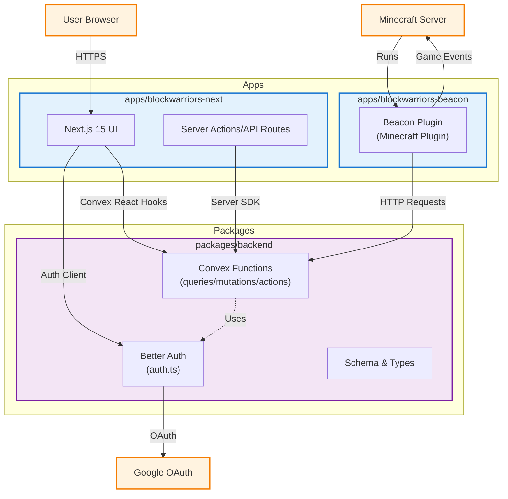

# BlockWarriors Technology Stack

This document provides a visual representation and explanation of the technology stack used in the BlockWarriors project.

## Architecture Diagram

## Stack Components

### Frontend

- **Next.js v15**: React framework for server-rendered applications
- **React v18**: JavaScript library for building user interfaces
- **TailwindCSS**: Utility-first CSS framework
- **Radix UI**: Unstyled, accessible UI component library

### Backend

- **Next.js Server Actions/API Routes**: API endpoints and server-side functions
- **Convex**: Hosted backend for type-safe queries, mutations, HTTP routes, and actions; used for data access and auth integration
- **Minecraft Server (Paper/Spigot API)**: Game server with plugin API
- **BlockWarriors Beacon Plugin**: Minecraft plugin (Java/Spigot) that connects to Convex via HTTP routes for match coordination, handles player authentication, match creation, and game events

### Monorepo Structure (apps/ and packages/)

- `apps/blockwarriors-next`
  - Next.js web dashboard (frontend UI)
  - Uses the Convex React client and Better Auth client
  - Reads client-side envs:
    - `NEXT_PUBLIC_CONVEX_URL`, `NEXT_PUBLIC_CONVEX_DEPLOYMENT`
    - `NEXT_PUBLIC_CONVEX_SITE_URL`, `NEXT_PUBLIC_SITE_URL`

- `apps/blockwarriors-beacon`
  - Minecraft plugin (Java/Spigot API 1.20.6)
  - Connects to Convex via HTTP routes
  - Handles player authentication, match creation, and game events
  - Commands: `/login`, `/creatematch`, `/listloggedin`
  - Polls Convex for queued matches and starts them when ready
  - Built with Maven, uses Multiverse Core for world management
  - Reads server envs:
    - `CONVEX_SITE_URL` (Convex HTTP routes URL)

- `packages/backend`
  - Shared Convex backend used by all apps
  - Convex functions live in `packages/backend/convex/*.ts` (queries, mutations, actions)
  - Auth is configured in `packages/backend/convex/auth.ts` (Better Auth + Google OAuth)
  - Generated API/types in `packages/backend/_generated/*` (via `npx convex dev` or `npm run convex:codegen`)
  - Reads Convex environment variables:
    - `GOOGLE_CLIENT_ID`, `GOOGLE_CLIENT_SECRET`, `SITE_URL`

At a glance:

- Frontend (Next.js) calls Convex HTTP routes directly.
- Convex hosts data logic, HTTP routes, and auth; all apps share the same generated API from `packages/backend`.
- Minecraft plugin (Beacon) connects to Convex HTTP routes for match coordination.
- All communication happens via Convex HTTP routes - no Socket.io server needed.
