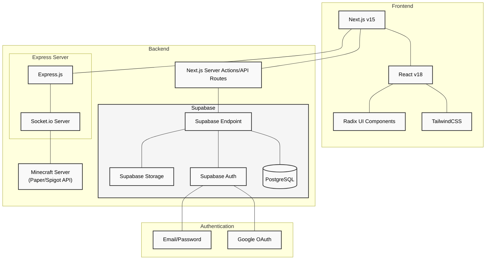

# BlockWarriors Technology Stack

This document provides a visual representation and explanation of the technology stack used in the BlockWarriors project.

## Architecture Diagram

## Stack Components

### Frontend
- **Next.js v15**: React framework for server-rendered applications
- **React v18**: JavaScript library for building user interfaces
- **TailwindCSS**: Utility-first CSS framework
- **Radix UI**: Unstyled, accessible UI component library

### Backend
- **Next.js Server Actions/API Routes**: API endpoints and server-side functions
- **Supabase**: Open source Firebase alternative providing:
  - **PostgreSQL**: Relational database
  - **Auth**: Authentication and authorization
  - **Storage**: File storage
- **Express.js**: Web application framework for Node.js
- **Socket.io**: Real-time bidirectional event-based communication
- **Minecraft Server (Paper/Spigot API)**: Game server with plugin API

### Authentication
- **Google OAuth**: Third-party authentication provider
- **Email/Password**: Traditional authentication method
