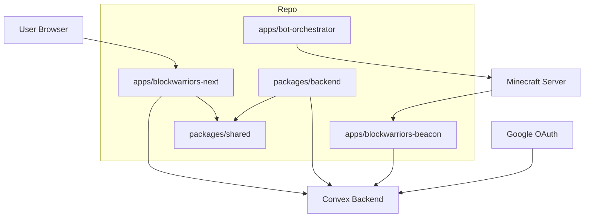

# BlockWarriors Technology Stack

## Architecture

```mermaid
graph TB
    User[User Browser]
    Google[Google OAuth]
    Convex[Convex Backend]
    MC[Minecraft Server]

    subgraph Repo
        Next["apps/blockwarriors-next"]
        Backend["packages/backend"]
        Beacon["apps/blockwarriors-beacon"]
        Bots["apps/bot-orchestrator"]
        Shared["packages/shared"]
    end

    User --> Next
    Next --> Convex
    Backend --> Convex
    Beacon --> Convex
    Bots --> MC
    Next --> Shared
    Backend --> Shared
    Google --> Convex
    MC --> Beacon
```

## Runtime Summary

### `apps/blockwarriors-next`

- Next.js 16
- React 18
- Tailwind + Radix
- Uses Convex client hooks and Better Auth integration
- Reads:
  - `NEXT_PUBLIC_BASE_URL`
  - `NEXT_PUBLIC_CONVEX_URL`
  - `NEXT_PUBLIC_CONVEX_DEPLOYMENT`
  - `NEXT_PUBLIC_CONVEX_SITE_URL`
  - `CONVEX_SITE_URL`

### `packages/backend`

- Convex functions, auth, schema, HTTP routes, and seeds
- Shared backend used by the web app and Beacon plugin
- Reads:
  - `SITE_URL`
  - `GOOGLE_CLIENT_ID`
  - `GOOGLE_CLIENT_SECRET`
  - `BETTER_AUTH_SECRET`
  - `CONVEX_HTTP_SECRET`
  - `CONVEX_SITE_URL`

### `apps/blockwarriors-beacon`

- Java/Paper plugin
- Polls Convex for match state and pushes telemetry/match updates
- Reads:
  - `CONVEX_SITE_URL`
  - `CONVEX_HTTP_SECRET`
  - `src/main/resources/config.yml`

### `apps/bot-orchestrator`

- Next.js + Socket.IO + Mineflayer
- Runs a bot control panel and server-side orchestrator
- Reads:
  - `PORT`
  - `MINECRAFT_HOST`
  - `MINECRAFT_PORT`
  - `DEBUG`

### `packages/shared`

- Shared TypeScript constants and response helpers
- `packages/shared/constants/game-config.json` is the source of truth for game config
- Beacon constants are regenerated from that file with `npm run codegen:beacon`
